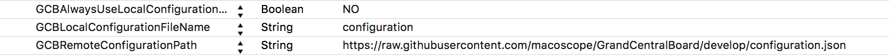

Grand Central Board for the Apple TV
====================================


[](https://travis-ci.org/macoscope/GrandCentralBoard)

[](http://cocoadocs.org/docsets/GCBCore)
[](http://cocoadocs.org/docsets/GCBCore)
[](http://cocoadocs.org/docsets/GCBCore)
[](http://cocoadocs.org/docsets/GCBCore)

Hang a TV in your open space or team room to show everyone what's up and get them up to speed.  

The board is a lightweight piece of code. The TV screen is to be used in landscape orientation and will be split into six rectangular widgets loaded from a remote configuration file. This is just a UIView, so you can use the space in any way you want. Updating the widgets is standardized, though, therefore you should not ignore this convention.

👷 Project maintained by: [@nsmeme](http://twitter.com/nsmeme) (Oktawian Chojnacki)

✋ Don't even ask - it's obviously written entirely in ♥️ [Swift 2.2](https://swift.org).

## GCBCore

The small set of sources needed to load configuration, initialize and show the Board.

## CocoaPods

[CocoaPods](http://cocoapods.org) is a dependency manager for Cocoa projects. 

You can install it with the following command:

```bash
$ gem install cocoapods
```

To integrate GCBCore into your Xcode project using CocoaPods, add this to your `Podfile`:

```ruby
pod 'GCBCore', '~> 1.0'
```

Then, run the following command:

```bash
$ pod install
```

### Usage

This is how you configure Grand Central Board:

```swift
let autoStack = AutoStack()
let scheduler = Scheduler()
let dataDownloader = DataDownloader()

let availableBuilders: [WidgetBuilding] = [
    ImageWidgetBuilder(dataDownloader: dataDownloader),
]

let configFileName = NSBundle.localConfigurationFileName
let configurationFetching = LocalConfigurationLoader(configFileName: configFileName,
                                                     availableBuilders: availableBuilders)

let boardController = GrandCentralBoardController(scheduler: self.scheduler, stack: self.autoStack)

let configurationRefresher = ConfigurationRefresher(interval: configRefreshInterval,
                                                    configuree: boardController,
                                                    fetcher: configurationFetching)
```

# Contributing

If you want to contribute, please [add an issue](https://github.com/macoscope/GrandCentralBoard/issues) and discuss your plans with us. This will allow us to give you assistance should you need it and to make sure that people aren’t working on the same things.

If you want to open a Pull Request, make sure you have [SwiftLint](https://github.com/Realm/SwiftLint) installed, and check that your project does not generate warnings or errors. Any warning will cause Travis build script to fail. 


# Widgets

## Adding a new Widget

There is a separate article ([TUTORIAL.md](./TUTORIAL.md)) covering adding new widgets.

## Components

A Widget consists of four main components:

- **View**: a view implementing `ViewModelRendering` protocol that displays the information.
- **Source**: implements one of the updating strategies (further described below).
- **Widget**: a controller class implementing `Widget` protocol that is exposed to the scheduler and connecting previous two components with each other.
- **WidgetBuilder**: implements `WidgetBuilding` protocol, instantiate Widget with settings from configuration file.


## Size

Widget canvas for 1080p:

- 640pt x 540pt

This size is constant and won't change on tvOS.

The GCBCore v2.0 will support iOS target but the canvas sizes are yet to be defined.

## Configuration

There are two ways to configure Grand Central Board: with a remote or bundled configuration file. 
A `JSON` file formatted like this is used to configure the Grand Central Board:

```json
{ "widgets":[ 
    {"name":"somewatch", "settings":  {"timeZone":"Europe/Warsaw"} },
    {"name":"somewatch", "settings":  {"timeZone":"Europe/Warsaw"} },
    {"name":"somewatch", "settings":  {"timeZone":"Europe/Warsaw"} },
    {"name":"somewatch", "settings":  {"timeZone":"Europe/Warsaw"} },
    {"name":"somewatch", "settings":  {"timeZone":"Europe/Warsaw"} },
    {"name":"somewatch", "settings":  {"timeZone":"Europe/Warsaw"} }
]}
```

**NOTE:** Each widget will have its own settings properties.

The way a configuration file is loaded is specified in `Info.plist` file.


### Remote configuration file

To have the configuration file loaded from a remote location, edit `Info.plist` and set `GCBRemoteConfigurationPath` to the desired location. Make sure `GCBAlwaysUseLocalConfigurationFile` is set to `NO`.

### Bundled configuration file

To use a bundled configuration file, set `GCBAlwaysUseLocalConfigurationFile` in `Info.plist` to `YES`. If necessary edit `GCBLocalConfigurationFileName` and check if the file is listed under `Copy Bundle Resources` in `Build Phases`.
For development purposes you can also launch the application via `GrandCentralBoard-LocalConfig` scheme.

## View States

Widget view should show these states:

- **Waiting** - starting state, presenting some activity indicator.
- **Rendering** - presenting information (after render method is called).
- **Failed** - data failed to load, should be avoided if possible.

## Source

The source should implement one of two protocols:

- **Synchronous** - the source will return value synchronously in a non-blocking way.

```swift
protocol Synchronous : Source {
    func read() -> ResultType
}
```

- **Asynchronous** - the source will call the provided block after the value is retrieved (only once). 

```swift
protocol Asynchronous : Source {
    func read(closure: (ResultType) -> Void)
}
```

- **Subscribable** - the source will call the provided block each time a new value arrives (multiple times). Note that `interval` can and often will be ignored.

```swift
public protocol Subscribable : Source {
    var subscriptionBlock: ((ResultType) -> Void)? { get set }
}
```

Fail can be handled silently, but there may be Widgets for which the fail state should be presented, the choice is up to you.

All strategies inherit the **Source** protocol:

```swift
public enum SourceType {
    case Cumulative
    case Momentary
}

public protocol UpdatingSource : class {
    var interval: NSTimeInterval { get }
}

public protocol Source : UpdatingSource {

    associatedtype ResultType

    var sourceType: SourceType { get }
}
```

# Credits

- Icon design based on illustration by [Michał Bednarski](https://www.behance.net/emas)