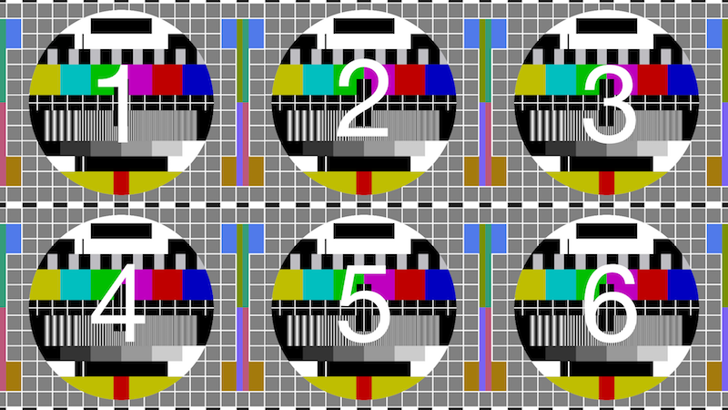

Grand Central Board
===================

## Widgets

### Order on screen



### Size

Widget canvas for 1080p:

- 640px x 540px

This size is constant and won't change on tvOS. Future releases are planned for iOS devices and they can have slightly different (and more dense) canvases. 


### Adding a new Widget

Four main components are important for adding a Widget:

- **Model** - implements one of the updating strategies (further described below)
- **View** - a view implementing `ViewModelRendering` protocol that display the information
- **Widget** - controller class implementing `Widget` protocol, exposed to the scheduler and connecting previous two with each other.
- **WidgetBuilder** - implements `WidgetBuilding` protocol, instantiate Widget with given settings.

### View State

Widget view should show these states:

- **Waiting** - starting state, presenting some activity indicator
- **Rendering** - presenting information (after render method is called)
- **Failed** - data failed to load, should be avoided if possible


### Updating strategies of the Source

The source should implement one  of the two protocols:

- **Synchronous** - the source will return value synchronously in a non-blocking way.

```swift
protocol Synchronous : Source {
    func read() -> ResultType
}
```

- **Asynchronous** - the source will call the provided block after the value is retrieved. 

```swift
protocol Asynchronous : Source {
    func read(closure: (ResultType) -> Void)
}
```

Any fail should be handled silently and printed to console in debug build but not presented to the user in any way.

All strategies inherits the **Source** protocol:


```swift
enum SourceType {
    case Cumulative
    case Momentary
}

enum Result<T> {
    case Failure
    case Success(T)
}

protocol Source {

    typealias ResultType

    var sourceType: SourceType { get }
    var optimalFrequency: NSTimeInterval { get }
}
```