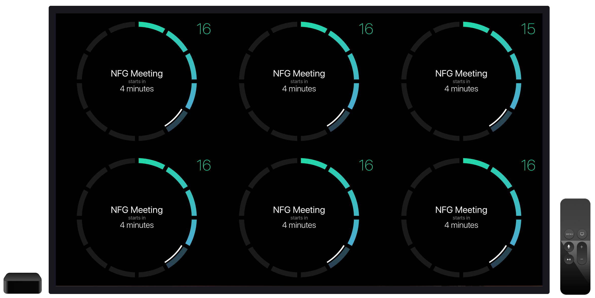

Grand Central Board for the Apple TV
====================================



Hang a TV in your open space or team room to show everyone what's up and get them up to speed.  

The board is a lightweight piece of code. The TV screen is to be used in landscape orientation and will be split into six rectangular widgets loaded from a remote configuration file. This is just a UIView, so you can use the space in any way you want. Updating the widgets is standardized, though, therefore you should not ignore this convention.

👷 Project maintained by: [@nsmeme](http://twitter.com/nsmeme) (Oktawian Chojnacki)

✋ Don't even ask - it's obviously written entirely in ♥️ [Swift 2](https://swift.org).

## Dependencies

We use [CocoaPods](https://cocoapods.org) and the current dependencies include:

- [Alamofire](https://github.com/Alamofire/Alamofire)
- [Decodable](https://github.com/Anviking/Decodable)

## Widgets

### Adding a new Widget

There is a separate article ([TUTORIAL.md](./TUTORIAL.md)) covering adding new widgets.

### Components

A Widget consists of four main components:

- **View**: a view implementing `ViewModelRendering` protocol that displays the information.
- **Source**: implements one of the updating strategies (further described below).
- **Widget**: a controller class implementing `Widget` protocol that is exposed to the scheduler and connecting previous two components with each other.
- **WidgetBuilder**: implements `WidgetBuilding` protocol, instantiate Widget with settings from configuration file.

### Widgets order on screen


### Size

Widget canvas for 1080p:

- 640px x 540px

This size is constant and won't change on tvOS. Future releases are planned for iOS devices and they will be able to utilize slightly different (and more dense) canvases.

### Configuration

A remote `JSON` file formatted like this is used to configure the Grand Central Board:

```json
{ "widgets":[ 
    {"name":"somewatch", "settings":  {"timeZone":"Europe/Warsaw"} },
    {"name":"somewatch", "settings":  {"timeZone":"Europe/Warsaw"} },
    {"name":"somewatch", "settings":  {"timeZone":"Europe/Warsaw"} },
    {"name":"somewatch", "settings":  {"timeZone":"Europe/Warsaw"} },
    {"name":"somewatch", "settings":  {"timeZone":"Europe/Warsaw"} },
    {"name":"somewatch", "settings":  {"timeZone":"Europe/Warsaw"} }
]}

```

**NOTE:** Each widget will have its own settings properties.

If you don't have your own server you can create a configuration file and run server locally. You don't have to install any frameworks, just run in your console:
```$ python -m SimpleHTTPServer``` and then provide new link in `Configuration.swift`.

## View States

Widget view should show these states:

- **Waiting** - starting state, presenting some activity indicator.
- **Rendering** - presenting information (after render method is called).
- **Failed** - data failed to load, should be avoided if possible.

## Source

The source should implement one of two protocols:

- **Synchronous** - the source will return value synchronously in a non-blocking way.

```swift
protocol Synchronous : Source {
    func read() -> ResultType
}
```

- **Asynchronous** - the source will call the provided block after the value is retrieved. 

```swift
protocol Asynchronous : Source {
    func read(closure: (ResultType) -> Void)
}
```

Fail can be handled silently, but there may be Widgets for which the fail state should be presented, the choice is up to you.

All strategies inherit the **Source** protocol:

```swift

enum SourceType {
    case Cumulative
    case Momentary
}

enum Result<T> {
    case Failure(ErrorType)
    case Success(T)
}

protocol Source {

    typealias ResultType

    var sourceType: SourceType { get }
    var optimalFrequency: NSTimeInterval { get }
}
```

# Summary

This project is still in its early stages and there is a lot to do. If you want to contribute, please add an issue and discuss your plans with us. This will allow us to give you assistance should you need it and to make sure that people aren’t working on the same things.

# Credits

- Watch widget design: [Dawid Woldu](http://macoscope.com/#dawid)
- Icon design based on illustration by [Michał Bednarski](https://www.behance.net/emas)