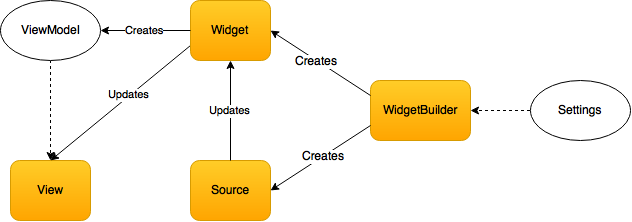
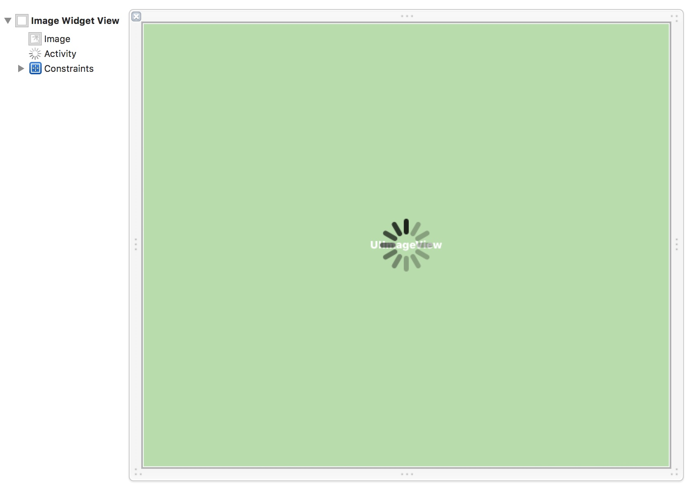

Tutorial: A Widget for the Grand Central Board
==============================================

As you may already know, we've recently [introduced](http://macoscope.com/blog/grand-central-board-for-the-apple-tv) a pretty cool project called the [Grand Central Board](https://github.com/macoscope/GrandCentralBoard) for the Apple TV. In this short tutorial, I will guide you through building a new widget with an asynchronous source fetching data from remote server.

Let's start with something easy. Our widget will be quite useful: its purpose will be to download an image every minute and display it on our TV. We can use the widget to present image from a webcam, show the weather outside, or just some slideshow from our last party.

Four main components are important for adding a Widget:

- **View** - a view implementing the `ViewModelRendering` protocol that displays the information.
- **Source** - implements one of the updating strategies (further described below).
- **Widget** - a controller class implementing the `Widget` protocol, presented to the scheduler and connecting the previous two with each other.
- **WidgetBuilder** - implements the `WidgetBuilding` protocol, instantiates the Widget with settings from configuration file.


This is how it all works together. Please note that this diagram is simplified:





### Groups


Add a new Group called **Image** in the **Widgets** group, then add two groups inside it: **Image/Source** and **Image/View**.

### 1. View


Views are limited to three states, the first two of which they have to display:

- Waiting (only once, before the first `render(viewModel:)` call)
- Rendering View Model
- Failure (can be ignored)

We should start by creating a **ViewModel**. There is only one image so this very simple struct will do:

```swift
struct ImageViewModel {
    let image: UIImage
}

```

We will call this view `ImageWidgetView`, so we should add a new file: 

**Widgets/Image/View/ImageWidgetView.swift**

```swift
import UIKit

// 1. Create View Model for view to render.
struct ImageViewModel {
    let image: UIImage
}

final class ImageWidgetView : UIView, ViewModelRendering {

	// 2. Set the associated type with the new ViewModel.
    typealias ViewModel = ImageViewModel


	// 3. Add IBOutlet for the image
    @IBOutlet private var image: UIImageView!
    
    // 4. Add IBOutlet for activity indicator.
    @IBOutlet private var activity: UIActivityIndicatorView!

    // MARK - ViewModelRendering

	// 5. Add state property, transition handling will be added later.
    private(set) var state: RenderingState<ViewModel> = .Waiting {
        didSet { handleTransitionFromState(oldValue, toState: state) }
    }
	// 6. Add render method.
    func render(viewModel: ViewModel) {
        state = .Rendering(viewModel)
    }

	// 7. This method is called when the source is unable to load the data.
    func failure() {
        state = .Failed
    }
    
    // 8. Add the method setting up the image from ViewModel.
    private func setUpImageWithViewModel(viewModel: ViewModel) {
        image.image = viewModel.image
    }
    
    // 9. Add the method hiding the activity indicator.
    private func transitionFromWaitingState() {
        UIView.animateWithDuration(0.3) {
            self.activity.alpha = 0
        }
    }
    
    // 9. Handle the transition between states.
    private func handleTransitionFromState(state: RenderingState<ViewModel>, toState: RenderingState<ViewModel>) {
        switch (state, toState) {
            case (.Waiting, .Rendering(let viewModel)): // This should be called only once.
                transitionFromWaitingState()
                setUpImageWithViewModel(viewModel)
            case (_, .Rendering(let viewModel)):
                setUpImageWithViewModel(viewModel)
            default:
                break
        }
    }
    
    // 10. Add this convenient way to load the view from a xib file.
    class func fromNib() -> ImageWidgetView {
        return NSBundle.mainBundle().loadNibNamed("ImageWidgetView", owner: nil, options: nil)[0] as! ImageWidgetView
    }
}

```

#### Interface Builder

The view will be designed in Interface Builder so we should create file:

**Image/View/ImageWidgetView.xib**.

Change the class of the newly created view to `ImageWidgetView` in Interface Builder.

Now we need to display an image, so we add `UIImageView` as a subview to the newly created view and fill the parent view with it using Constraints.

We should also place a `UIActivityIndicatorView` at the center. 

Connect the views to their **IBOutlets**.




### 2. Source

Now it's time for the source. Fetching images from the Internet is an asynchronous operation, so we will implement the `Asynchronous` protocol. 

**Widgets/Image/Source/RemoteImageSource**

```swift
import UIKit
import Alamofire

// 1. Create a model.
struct Image : Timed {
    let value: UIImage
    let time: NSDate
}

// 2. Define error type for downloading failure.
enum RemoteImageSourceError : ErrorType {
    case DownloadFailed
}

final class RemoteImageSource : Asynchronous {

	// 3. Set associated type of 
    typealias ResultType = Result<Image>

	// 4. These two properties are mandatory for any source.
    let interval: NSTimeInterval
    let sourceType: SourceType = .Momentary

	// 5. Property to store image url.
    private let url: NSURL

	// 6. Initialize stored properties, the interval between image fetches.
    init(url: NSURL, interval: NSTimeInterval = 30) {
        self.interval = interval
        self.url = url
    }

	// 7. This method is called on each update cycle. We use Alamofire to download the image.
    func read(closure: (ResultType) -> Void) {
        Alamofire.request(.GET, url).response { (request, response, data, error) in

            if let data = data, image = UIImage(data: data) {
                let image = Image(value: image, time: NSDate())
                closure(.Success(image))
                return
            }

            closure(.Failure(error ?? RemoteImageSourceError.DownloadFailed))
        }
    }
}
```


### 3. Widget Subclass

The Widget subclass is a controller class that is configured with sources and the view, and is later displayed as a dashboard widget.

**/Widgets/Image/ImageWidget.swift**

```swift
import UIKit

final class ImageWidget : Widget {

    let widgetView: ImageWidgetView
    let sources: [UpdatingSource]

    init(view: ImageWidgetView, sources: [UpdatingSource]) {
        self.widgetView = view
        self.sources = sources
    }

    var view: UIView {
        return widgetView
    }

    func update(source: UpdatingSource) {
        switch source {
            case let source as RemoteImageSource:
                updateImageFromSource(source)
            default:
                assertionFailure("Expected `source` as instance of `RemoteImageSource`.")
        }
    }

    private func updateImageFromSource(source: RemoteImageSource) {
        source.read { [weak self] result in
            switch result {
                case .Success(let image):
                    let imageViewModel = ImageViewModel(image: image.value)
                    self?.widgetView.render(imageViewModel)
                case .Failure:
                    break
            }
        }
    }
}
```


### 4. Configuration file

*(coming soon)*

### 5. Widget Builder

*(coming soon)*

### Effect

*(coming soon)*


